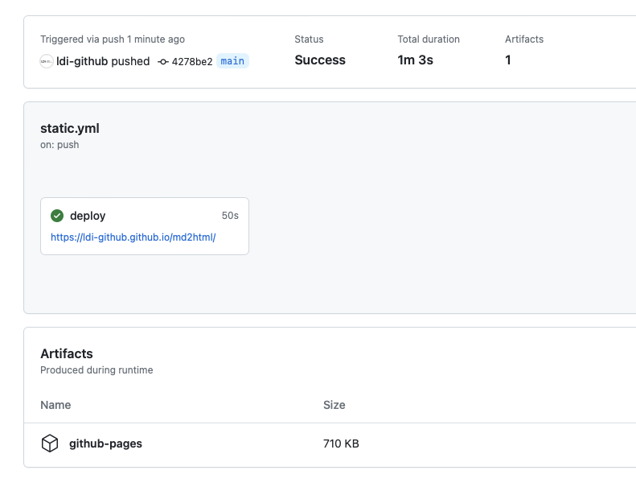

# Run task on GitHub actions

You can run `md2html` task on GitHub actions and deploy static html files on GitHub pages.

1. Open you GitHub repository in browser.
2. Go GitHub Pages Setting (Settings > Pages)
3. Select source as GitHub Actions.
4. Click `Configure` button in **Static HTML** section.
5. Create `static.yaml` as follows.

```yaml
# Simple workflow for deploying static content to GitHub Pages
name: Deploy static content to Pages

on:
  # Runs on pushes targeting the default branch
  push:
    branches: [ "main" ]

  # Allows you to run this workflow manually from the Actions tab
  workflow_dispatch:

# Sets permissions of the GITHUB_TOKEN to allow deployment to GitHub Pages
permissions:
  contents: read
  pages: write
  id-token: write

# Allow only one concurrent deployment, skipping runs queued between the run in-progress and latest queued.
# However, do NOT cancel in-progress runs as we want to allow these production deployments to complete.
concurrency:
  group: "pages"
  cancel-in-progress: false

jobs:
  # Single deploy job since we're just deploying
  deploy:
    environment:
      name: github-pages
      url: ${{ steps.deployment.outputs.page_url }}
    runs-on: ubuntu-latest
    steps:
      - name: Checkout
        uses: actions/checkout@v3
      - name: Setup Java
        uses: actions/setup-java@v3
        with:
          distribution: 'corretto'
          java-version: '17'
          cache: 'gradle'
      - name: md2html
        run: ./gradlew md2html --args="gtag=true"
      - name: Setup Pages
        uses: actions/configure-pages@v3
      - name: Upload artifact
        uses: actions/upload-pages-artifact@v1
        with:
          # Upload entire repository
          path: 'doc/out'
      - name: Deploy to GitHub Pages
        id: deployment
        uses: actions/deploy-pages@v2
```

6. Commit changes.
7. Click `Actions` tab. You can see a job executing.
8. If the jobs succeeded you can see static web page on GitHub pages. Click the url on deploy task.
   <br>

### Link

- [index](../index.md)
