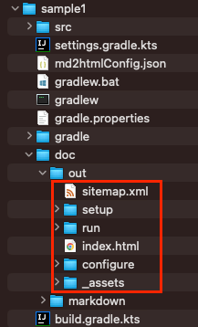
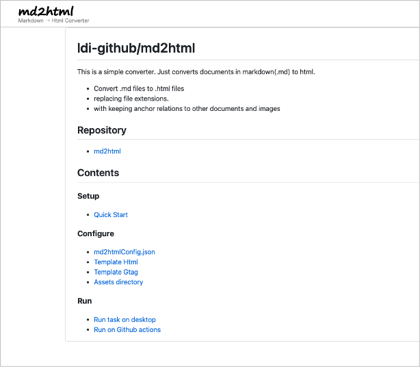

# Quick Start

This document explains how to set up **md2html** using IntelliJ IDEA.

## Installation

### IntelliJ IDEA

If you have not installed, download Ultimate or COMMUNITY and install it.
(COMMUNITY is opensource product)

https://www.jetbrains.com/idea/

## Create sample project

1. Open IntelliJ IDEA, select `File > New > Project`.
1. In New Project window, select `New Project` tab.
1. Input fields.
    - `Name: sample1`
    - `Location: (Your location)`
    - `Language: Kotlin`
    - `Build system: Gradle`
    - `JDK: (Your choice)`
    - `Gradle DSL: Kotlin`
    - `Add sample code: OFF`
      <br>
1. Click `Create`.
1. Wait for a while until background tasks finish. It may take minutes.

### build.gradle.kts (after created)

```
plugins {
    kotlin("jvm") version "1.9.21"
}

group = "org.example"
version = "1.0-SNAPSHOT"

repositories {
    mavenCentral()
}

dependencies {
    testImplementation("org.jetbrains.kotlin:kotlin-test")
}

tasks.test {
    useJUnitPlatform()
}
kotlin {
    jvmToolchain(17)
}
```

Append some lines as follows.

### build.gradle.kts (after edit)

```
plugins {
    kotlin("jvm") version "1.8.20"
}

group = "org.example"
version = "1.0-SNAPSHOT"

repositories {
    mavenCentral()
}

dependencies {
    testImplementation(kotlin("test"))

    // md2html
    implementation("io.github.ldi-github:md2html:0.2.0")
}

tasks.test {
    useJUnitPlatform()
}

kotlin {
    jvmToolchain(11)
}

/**
 * md2html
 */
tasks.register<JavaExec>("md2html") {
    group = "md2html"
    classpath = sourceSets["main"].runtimeClasspath
    mainClass.set("md2html.Executor")
}
```

Click reload on Gradle pane.
<br>

## Copy files

1. Copy files in md2html project and paste to sample1 project.
2. Commit files to git repository.


## Configure md2htmlConfig.json

1. Open `md2htmlConfig.json`.
1. Edit `siteRoot`.

```json
{
  "inputDirectory": "doc/markdown",
  "outputDirectory": "doc/out",
  "generateSitemap": "true",
  "siteRoot": "https://ldi-github.github.io/md2html/"
}
```

## Run md2html

1. Run md2html task.
   <br>
1. You can see generated html file under `sample1/doc/out` directory.
   <br>
1. Open `index.html`.
   <br>
1. Open `sitemap.xml`.
   <br>

### Link

- [index](../index.md)
